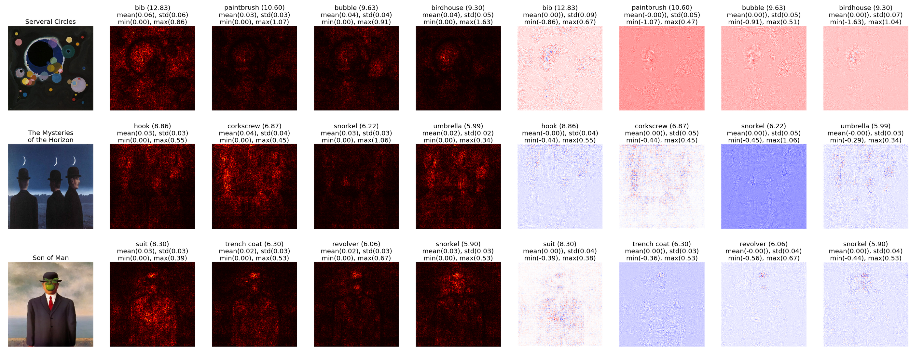

# Neural-Net-Image-Saliency
A look into image saliency for 2D convultional neural nets

Source code can be viewed interactively at

https://colab.research.google.com/github/KappnKrunch/Neural-Net-Image-Saliency/blob/main/Abstract_Art_Vanilla_Gradient.ipynb
